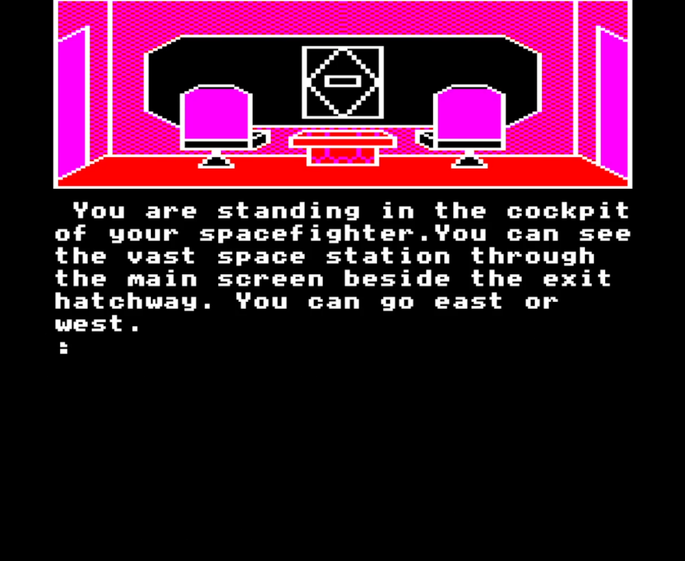
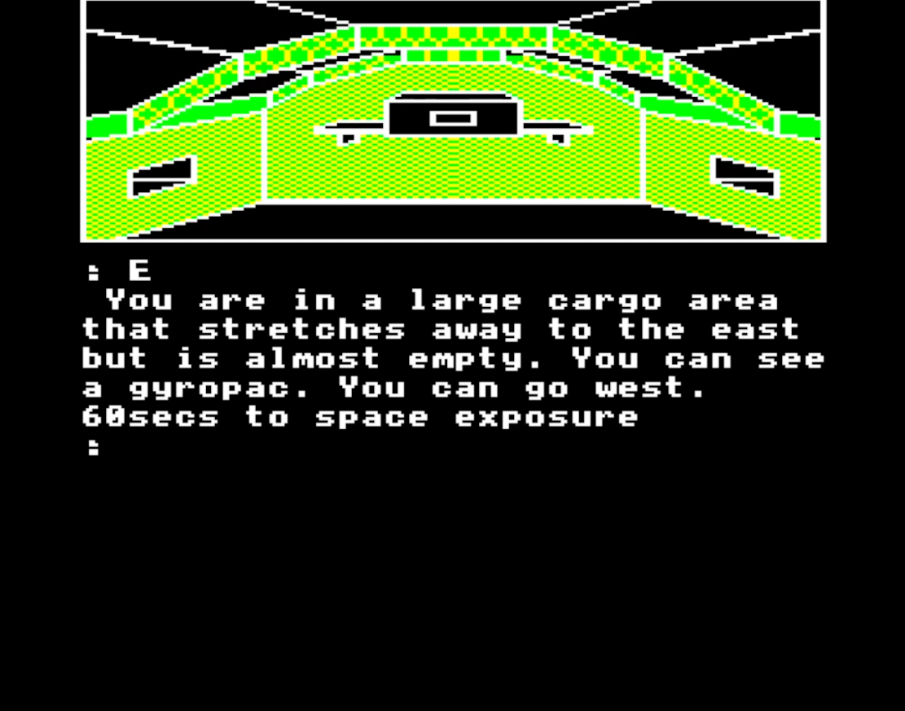
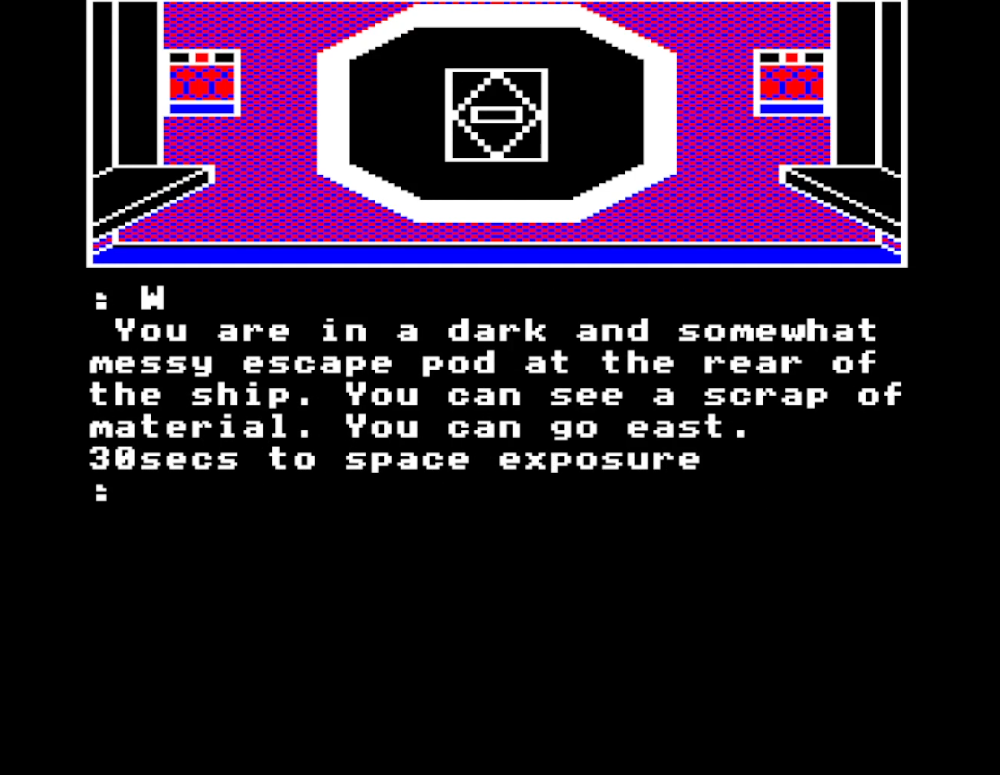

# The Hunt releases

The Hunt, an 8-bit game for the Acorn Electron.

Original game (c) Ian Muriss 1987 for Robico Software.
Enhanced version for the Acorn Electron by 0xC0DE in 2022.

## Enhancements

- Split screen shows graphics and text at the same time
- Added intro text and title screen from the BBC Micro version
- Load/save one game position from/to memory

## Screenshots

## How to play

### Introduction

As the pilot of an intergalactic space craft, you have searched the galaxy for the kidnapper of your crew member Shauna. Your mission has led you to an enormous space station, devoted to scientific study and experimentation, where you have finally docked in berth 5820. Your space craft is battered and on the verge of collapse. Only the 'hull integrity system' is preventing loss of atmosphere and that, too, will  fail in a few seconds time! 

You are on the last stages of the hunt. Your search for Shauna is almost over. All you must do now is escape to the space station, explore it and find Shauna, and return with her to the flight deck of your ship.

### Entering commands

The Hunt has a command line interpreter that allows sentences but not multiple statements. In other words, a command such as `GIVE GUN TO LUGOBOT` would be understood, but `EXAMINE THE GUN THEN GO NORTH` would not. 

The usual adventure words may be used. For example:

`INV` gives an inventory or list of your possessions; `LOOK` describes your surroundings; `EXAMINE` takes a close look at an object; `GET` picks up an object and `DROP` leaves an object behind.
`GET` and `DROP` may be used with an object name, for example `GET GUN`, or with the words `ALL` or `EVERYTHING`. `GET` on its own gets the first object in the room.

`SAVE` will store your position to memory. `LOAD` or `RESTORE` will load a previous position from memory.
`QUIT` will restart the game from the beginning.

The following directional commands are understood: `NORTH (N)`, `SOUTH (S)`, `EAST (E)`, `WEST (W)`, `NORTHEAST (NE)`, `NORTHWEST (NW)`, `SOUTHEAST (SE)` and `SOUTHWEST (SW)`. `UP` and `DOWN` and `IN` and `OUT` may also prove useful in places.

### Characters

In your quest you will meet various characters including the Lugobot, the terse Servobot, the Aggrodroid and the Guardroid!
A monkey and a dog should prove useful and if you are a particularly skilled adventurer you will meet the evil kidnapper and hopefully Shauna herself!

### Hints and tips
Make a map! The Hunt has many locations and it is quite easy to become lost.

Every object has at least one use.

There is no magic in The Hunt, but in a science fiction adventure, who knows what might happen?

Getting started: `EAST`, `WEAR GYRO`, `WEST`, `WEST`, `GET SCRAP`...`HIRE TAXI`...

---

The Hunt, enhanced version for the Acorn Electron by [0xC0DE](https://twitter.com/0xC0DE6502)
